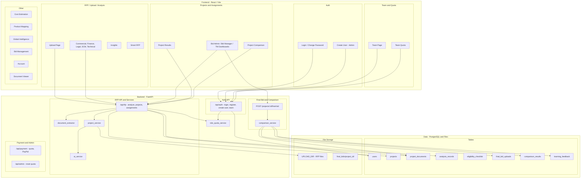
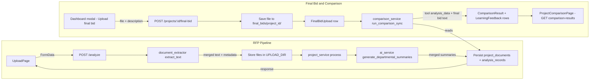

# Bid Intelligence – Architecture

This document describes the high-level architecture of the Bid Intelligence tool: functional components, the end-to-end data flow from RFP upload to comparison and learning, and the feedback mechanism that improves AI extraction over time.

---

## 1. Architecture Diagram of All Functionality

The system is organized into three layers: **Frontend** (React/Vite, role-based dashboards and feature pages), **Backend** (FastAPI routers and services), and **Data** (PostgreSQL and file storage). Components are grouped by capability.



---

## 2. Data Flow Pipeline

End-to-end flow from RFP upload through extraction, AI analysis, persistence, final bid upload, and comparison. Learning feedback is stored during comparison and consumed on the next AI run (see Section 3).



**Step summary:**

| Step | Component | Data |
|------|------------|------|
| 1 | UploadPage | User selects project, files, options; sends FormData |
| 2 | POST /analyze | Reads files, calls document_extractor |
| 3 | document_extractor | PDF/DOCX/Excel/OCR → merged text, metadata |
| 4 | Backend | Writes files to UPLOAD_DIR; creates/updates project and document records |
| 5 | project_service | Calls ai_service; merges with existing analysis if any; OEM enrichment, validation |
| 6 | Persist | project_documents.analysis_data, analysis_records; response to frontend |
| 7 | Dashboard modal | User uploads final bid file + description |
| 8 | POST final-bid | Saves file under final_bids/{project_id}/; creates FinalBidUpload row |
| 9 | comparison_service | Loads latest ProjectDocument.analysis_data and final bid extracted text; computes diffs; writes ComparisonResult and LearningFeedback; sets FinalBidUpload.status = processed |
| 10 | ProjectComparisonPage | GET /projects/:id/comparison-results and GET /comparison-results/:id; displays comparison_output (summary + differences). Learning feedback is not exposed via API. |

---

## 3. Feedback Mechanism Architecture

Comparison produces tool-vs-user differences; each difference is stored as **LearningFeedback**. On the next RFP analysis, the AI user prompt is augmented with "PAST USER CORRECTIONS" from LearningFeedback so the model can align future extractions with past user corrections.

```mermaid
flowchart TB
  subgraph ComparisonWrites [Comparison Writes]
    CS[comparison_service]
    CS -->|"comparison_output JSON"| CR[(ComparisonResult)]
    CS -->|"one row per difference"| LF[(LearningFeedback)]
    CS -->|"status = processed"| FBU[(FinalBidUpload)]
  end

  subgraph NoAPI [No REST API]
    note[LearningFeedback is never read or written by any REST endpoint]
  end

  subgraph NextAnalysis [Next RFP Analysis]
    build[build_user_prompt]
    get_fb[get_learning_feedback_prompt]
    user_prompt[user_prompt with "PAST USER CORRECTIONS"]
    gen[generate_departmental_summaries - OpenAI]
  end

  subgraph UIVisibility [UI Visibility]
    api_read[GET /comparison-results]
    api_read --> ProjectComparisonPage[ProjectComparisonPage]
    CR --> api_read
    LF -.->|"read only by ai_service"| get_fb
  end

  build --> get_fb
  get_fb -->|"query up to 50 rows"| LF
  get_fb --> user_prompt
  build --> user_prompt
  user_prompt --> gen
```

**Flow in words:**

1. **Source:** After `comparison_service` computes differences (tool_value vs user_value per section/field), it writes one **ComparisonResult** row (comparison_output JSON) and one **LearningFeedback** row per difference (project_id, source_comparison_id, section_or_key, tool_value, user_value).
2. **No API for feedback:** LearningFeedback is internal; no REST endpoint reads or writes it.
3. **Consumption:** On a later RFP analysis, `generate_departmental_summaries()` uses `build_user_prompt(document_text, file_name, project_id)`. That calls `get_learning_feedback_prompt(project_id)`, which queries up to 50 LearningFeedback rows (project-scoped or org-wide), formats them as "PAST USER CORRECTIONS (align your extraction with these when relevant): …", and appends that block to the user prompt. The model sees past corrections and can align new extractions accordingly.
4. **Visibility:** Comparison results (what was compared) are visible in the UI via ProjectComparisonPage; the LearningFeedback store itself is not shown in the UI.

**Key files:**

- **Write feedback:** [Backend_py/services/comparison_service.py](Backend_py/services/comparison_service.py)
- **Read feedback and inject into prompt:** [Backend_py/services/ai_service.py](Backend_py/services/ai_service.py) (`get_learning_feedback_prompt`, `build_user_prompt`)
- **Models:** [Backend_py/models/sqlalchemy_models.py](Backend_py/models/sqlalchemy_models.py) (ComparisonResult, LearningFeedback)
